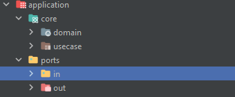

# ARQUITETURA HEXAGONAL

##  O que é a Arquitetura Hexagonal?

A arquitetura hexagonal, criada por Alistair Cockburn, é um estilo arquitetural que tem um objetivo principal:

- Isolar o núcleo da aplicação (regras de negócio) das partes externas (banco, API, framework, etc.)

Ou seja:

O core deve ser totalmente independente de qualquer tecnologia.
Quem depende de quem são os frameworks, não o core.

Ela é organizada em 3 camadas lógicas:

## 1. Core Domain

(Entidades, regras de negócio, Value Objects)

É a parte mais pura do sistema.
Não tem Spring, não tem annotations, não tem HTTP, não tem JSON, não tem JPA.

Exemplo:

- Pedido, Cliente, Produto

- Regras de validação

- Cálculo de preço

- Políticas do negócio

## 2. Application / Use Cases

(Orquestra o domínio — mas sem tecnologia)

Essa camada coordena o fluxo:

Recebe comandos (inputs)

Usa o domínio

Chama repositórios (através de interfaces)

Aplica regras de casos de uso

Aqui ficam:

- Use cases

- Input ports

- Output ports (interfaces de repositório, mensageria etc.)

Ainda não tem framework aqui.

## 3. Adapters / Infrastructure

(Concreto, dependente de tecnologia)

Tudo aquilo que "pluga" no core:

Tipo de Adapter	Exemplos
Driver (Entrada)	Controllers REST, CLI, Eventos, gRPC
Driven (Saída)	Banco (JPA), Kafka, RabbitMQ, APIs externas

Aqui sim mora o Spring, JSON, HTTP, JPA, JDBC, etc.

### 🔌 Ports

São interfaces que definem o contrato entre o core e o mundo externo.

Existem dois tipos:

#### 1. Input Port

Interface que os adapters de entrada chamam para executar um caso de uso.

#### 2. Output Port

Interface que o core usa para chamar algo externo (ex: salvar no banco).

# 🧠 Por que o nome “hexagonal”?

É apenas uma metáfora:

cada lado do hexágono representa um “port”

cada port pode ser conectado (adaptado) por diferentes tecnologias

O nome real é:

- Ports and Adapters Architecture

O motivo principal da arquitetura
Desacoplamento total do core

O domínio não conhece:

- Spring

- Banco de dados

- Frameworks

- HTTP

- Filas

- Segurança

- Cloud

- Libraries

Isso dá:

- ✔ Testes mais fáceis (sem mockar framework)
- ✔ Independência de framework
- ✔ Fácil trocar infraestrutura (JPA → JDBC → Mongo)
- ✔ Domínio mais limpo e expressivo
- ✔ Zero dependência externa


# Entendendo o fluxo da aplicação

Ao estudar um pouco sobre como a arquitetura hexagonal funciona, confesso que me senti um pouco perdido de como
o fluxo de fato funciona, não é nem relacionado a código ou tecnologias envolvidas, mas é pelo fato da forma que ele está sendo estruturado.
Sei que parece estranho a primeira vista, mas conforme você vai mexendo , você vai se encontrando  pela estrutura.
Entao criei esse projeto com o intuito de entender de como funciona e anotarei os passos logo abaixo para poder entender o que cada um faz.
Lembrando que isso é um estudo pessoal, o que vai  muito da minha análise e nunca trabalhei de forma profissional com essa arquitetura.Mas espero que
com esse estudo, possa tirar o maximo possível de dúvidas.

Vamos explorar agora o projeto e como ele  se comporta.

## Na pasta application vamos ter duas pastas:
    
 - core: onde vamos ter nossas classes de dominios e usecases(que seria o service no MVC)
 - ports: dentro dela vamos ter duas pastas:
    
in: Eles representam o que o domínio disponibiliza para o mundo externo.
    
out: Eles representam o que o domínio PRECISA que o mundo externo faça por ele.

Essa parte ainda vai ficar clara, mas vamos  destrinchando e descobrindo como funciona.

## Domain

Na pasta domain vamos ter nossas classes de dominios sem depender de framework, sem anotação,praticamente pura.

```java

package com.ricardo.hexagonal_architecture.application.core.domain;

public class Customer {
    private String id;
    private String name;
    private Address address;
    private String cpf;
    private Boolean isValidCpf;

    public String getId() {
        return id;
    }

    public void setId(String id) {
        this.id = id;
    }

    public String getName() {
        return name;
    }

    public void setName(String name) {
        this.name = name;
    }

    public Address getAddress() {
        return address;
    }

    public void setAddress(Address address) {
        this.address = address;
    }

    public String getCpf() {
        return cpf;
    }

    public void setCpf(String cpf) {
        this.cpf = cpf;
    }

    public Boolean getValidCpf() {
        return isValidCpf;
    }

    public void setValidCpf(Boolean validCpf) {
        isValidCpf = validCpf;
    }

    public Customer(String id, String name, Address address, String cpf, Boolean isValidCpf) {
        this.id = id;
        this.name = name;
        this.address = address;
        this.cpf = cpf;
        this.isValidCpf = isValidCpf;
    }

    public Customer() {
        this.isValidCpf = false;
    }
}
```
Observe que a classe está pura sem utilização do lombok, getters and setters e construtores declarados na mão.


# Então basicamente o fluxo funciona dessa forma:

CustomerController recebe  a interface InsertCustomerInputPort

```java
package com.ricardo.hexagonal_architecture.adapters.in.controllers;

import com.ricardo.hexagonal_architecture.adapters.in.controllers.mapper.CustomerMapper;
import com.ricardo.hexagonal_architecture.adapters.in.controllers.request.CustomerRequest;
import com.ricardo.hexagonal_architecture.adapters.in.controllers.response.CustomerResponse;
import com.ricardo.hexagonal_architecture.application.ports.in.FindCustomerByIdInputPort;
import com.ricardo.hexagonal_architecture.application.ports.in.InsertCustomerInputPort;
import jakarta.validation.Valid;
import lombok.RequiredArgsConstructor;
import org.springframework.http.ResponseEntity;
import org.springframework.web.bind.annotation.*;

@RestController
@RequestMapping("/api/v1/customers")
@RequiredArgsConstructor
public class CustomerController {

    private final InsertCustomerInputPort insertCustomerInputPort;

    @PostMapping
    public ResponseEntity<Void> insert(@RequestBody @Valid CustomerRequest customerRequest ){
        var customer = customertMapper.toCustomer(customerRequest);
        insertCustomerInputPort.insert(customer, customerRequest.getZipcode());
        return ResponseEntity.ok().build();
    }
}
```
que por sua vez InsertCustomerUseCase(classe concreta) implementa InsertCustomerInputPort

```java
package com.ricardo.hexagonal_architecture.application.core.usecase;

import com.ricardo.hexagonal_architecture.application.core.domain.Customer;
import com.ricardo.hexagonal_architecture.application.ports.in.InsertCustomerInputPort;
import com.ricardo.hexagonal_architecture.application.ports.out.FindAddressByZipCodeOutputPort;
import com.ricardo.hexagonal_architecture.application.ports.out.InsertCustomerOutputPort;

public class InsertCustomerUseCase implements InsertCustomerInputPort {

    private final FindAddressByZipCodeOutputPort findAddressByZipCodeOutputPort;
    private final InsertCustomerOutputPort insertCustomerOutputPort;

    public InsertCustomerUseCase(FindAddressByZipCodeOutputPort findAddressByZipCodeOutputPort,InsertCustomerOutputPort insertCustomerOutputPort) {
        this.findAddressByZipCodeOutputPort = findAddressByZipCodeOutputPort;
        this.insertCustomerOutputPort = insertCustomerOutputPort;
    }

    @Override
    public void insert(Customer customer, String zipcode) {
        var address = findAddressByZipCodeOutputPort.find(zipcode);
        customer.setAddress(address);
        insertCustomerOutputPort.insert(customer);
    }
}
```
E que InsertCustomerInputPort é o contrato para poder inserir um Customer

```java
package com.ricardo.hexagonal_architecture.application.ports.in;

import com.ricardo.hexagonal_architecture.application.core.domain.Customer;

public interface InsertCustomerInputPort {
    
    void insert (Customer customer, String zipcode);
}

```

Dentro de InsertCustomerUseCase temos uma dependencia chamada InsertCustomerOutputPort

```java
package com.ricardo.hexagonal_architecture.application.ports.out;

import com.ricardo.hexagonal_architecture.application.core.domain.Customer;

public interface InsertCustomerOutputPort {

    void insert(Customer customer);
}
```
que por sua vez é implementada pela classe InsertCustomerAdapter 

```java
package com.ricardo.hexagonal_architecture.adapters.out;

import com.ricardo.hexagonal_architecture.adapters.out.repositories.CustomerRepository;
import com.ricardo.hexagonal_architecture.adapters.out.repositories.mapper.CustomerEntityMapper;
import com.ricardo.hexagonal_architecture.application.core.domain.Customer;
import com.ricardo.hexagonal_architecture.application.ports.out.InsertCustomerOutputPort;
import lombok.RequiredArgsConstructor;
import org.springframework.stereotype.Component;

@Component
@RequiredArgsConstructor
public class InsertCustomerAdapter implements InsertCustomerOutputPort {

    private final CustomerRepository customerRepository;
    private final CustomerEntityMapper customerEntityMapper;

    @Override
    public void insert(Customer customer) {
        var customerEntity =  customerEntityMapper.toCustomerEntity(customer);
        customerRepository.save(customerEntity);
    }
}

```

que possui a dependência do CustomerRepository, camada que vai ser responsavel pela comunicação com o banco de dados;

```java
package com.ricardo.hexagonal_architecture.adapters.out.repositories;

import com.ricardo.hexagonal_architecture.adapters.out.repositories.entities.CustomerEntity;
import org.springframework.data.mongodb.repository.MongoRepository;

public interface CustomerRepository extends MongoRepository<CustomerEntity,String> {
}

```

